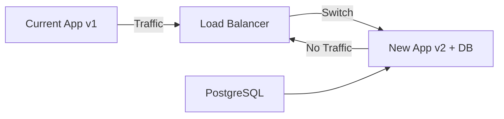

# Database Migration Plan

This document outlines the plan for migrating from Redis-only caching to a persistent database solution for enhanced features and data persistence.

## Table of Contents

- [Current State](#current-state)
- [Migration Goals](#migration-goals)
- [Proposed Schema](#proposed-schema)
- [Migration Strategy](#migration-strategy)
- [Zero-Downtime Migration](#zero-downtime-migration)
- [Rollback Plan](#rollback-plan)
- [Database Choice](#database-choice)

---

## Current State

### Current Architecture

Kuya Comps currently uses:

- **Redis**: In-memory caching for API responses
  - Sold listings cache (TTL: 30 minutes)
  - Active listings cache (TTL: 5 minutes)
  - Ephemeral - data lost on Redis restart

- **No Persistent Storage**: All data is fetched on-demand from APIs
  - SearchAPI.io for sold listings
  - eBay Browse API for active listings

### Limitations

1. **No Historical Data**: Cannot track price trends over time
2. **No User Accounts**: Cannot save searches or preferences
3. **No Analytics**: Cannot analyze search patterns or popular cards
4. **Cache-Only**: All data lost if Redis restarts
5. **API Dependency**: Every cache miss requires API call

---

## Migration Goals

### Primary Goals

1. **Persist Search History**: Store search queries and results for analytics
2. **Enable Price Tracking**: Track card prices over time for trend analysis
3. **User Preferences**: Store user settings and saved searches (future feature)
4. **Reduce API Costs**: Cache results persistently to reduce API calls
5. **Improve Performance**: Faster response times with database queries

### Non-Goals

- Replace Redis (Redis will remain for hot caching)
- Store all eBay listing data (only metadata and prices due to eBay ToS)
- Real-time data replication (acceptable 5-30 minute delay)

---

## Proposed Schema

### Database: PostgreSQL

PostgreSQL is recommended for:
- JSON support for flexible schema
- Good Python integration (asyncpg, SQLAlchemy)
- Available on Railway/Render
- ACID compliance for data integrity

### Tables

#### 1. `searches`

Stores search query metadata.

```sql
CREATE TABLE searches (
    id SERIAL PRIMARY KEY,
    query TEXT NOT NULL,
    search_type VARCHAR(20) NOT NULL,  -- 'sold' or 'active'
    filters JSONB,  -- {raw_only: bool, base_only: bool, exclude_auto: bool}
    pages_scraped INTEGER,
    items_count INTEGER,
    created_at TIMESTAMP WITH TIME ZONE DEFAULT NOW(),
    execution_time_ms INTEGER,
    cache_hit BOOLEAN DEFAULT FALSE,
    user_id INTEGER REFERENCES users(id)  -- Future: user tracking
);

CREATE INDEX idx_searches_query ON searches(query);
CREATE INDEX idx_searches_created_at ON searches(created_at);
CREATE INDEX idx_searches_user_id ON searches(user_id);
```

#### 2. `price_snapshots`

Stores aggregated price data for trend analysis.

```sql
CREATE TABLE price_snapshots (
    id SERIAL PRIMARY KEY,
    card_identifier TEXT NOT NULL,  -- Normalized card name
    search_id INTEGER REFERENCES searches(id),
    snapshot_date DATE NOT NULL,
    
    -- Aggregated pricing
    fmv_low NUMERIC(10, 2),
    fmv_high NUMERIC(10, 2),
    market_value NUMERIC(10, 2),
    quick_sale NUMERIC(10, 2),
    patient_sale NUMERIC(10, 2),
    
    -- Statistics
    sample_size INTEGER,
    min_price NUMERIC(10, 2),
    max_price NUMERIC(10, 2),
    avg_price NUMERIC(10, 2),
    volume_confidence VARCHAR(20),
    
    -- Market intelligence
    parallel_analysis JSONB,
    grading_analysis JSONB,
    
    created_at TIMESTAMP WITH TIME ZONE DEFAULT NOW(),
    
    UNIQUE(card_identifier, snapshot_date)
);

CREATE INDEX idx_price_snapshots_card ON price_snapshots(card_identifier);
CREATE INDEX idx_price_snapshots_date ON price_snapshots(snapshot_date);
```

#### 3. `listing_cache`

Persistent cache for individual listings (respecting eBay ToS - metadata only).

```sql
CREATE TABLE listing_cache (
    id SERIAL PRIMARY KEY,
    item_id VARCHAR(50) UNIQUE NOT NULL,
    title TEXT NOT NULL,
    price NUMERIC(10, 2),
    listing_type VARCHAR(20),  -- 'auction', 'buy_it_now'
    condition VARCHAR(50),
    sold BOOLEAN,
    sold_date TIMESTAMP WITH TIME ZONE,
    
    -- Minimal metadata (eBay ToS compliant)
    bids INTEGER,
    watchers INTEGER,
    
    -- Caching
    first_seen TIMESTAMP WITH TIME ZONE DEFAULT NOW(),
    last_updated TIMESTAMP WITH TIME ZONE DEFAULT NOW(),
    ttl TIMESTAMP WITH TIME ZONE,  -- When to refresh
    
    -- Search association
    search_id INTEGER REFERENCES searches(id)
);

CREATE INDEX idx_listing_cache_item_id ON listing_cache(item_id);
CREATE INDEX idx_listing_cache_ttl ON listing_cache(ttl);
CREATE INDEX idx_listing_cache_sold_date ON listing_cache(sold_date);
```

#### 4. `users` (Future)

For user account management.

```sql
CREATE TABLE users (
    id SERIAL PRIMARY KEY,
    email VARCHAR(255) UNIQUE NOT NULL,
    password_hash VARCHAR(255),  -- Or use OAuth
    display_name VARCHAR(100),
    created_at TIMESTAMP WITH TIME ZONE DEFAULT NOW(),
    last_login TIMESTAMP WITH TIME ZONE,
    is_active BOOLEAN DEFAULT TRUE
);

CREATE INDEX idx_users_email ON users(email);
```

#### 5. `saved_searches` (Future)

For saving user searches.

```sql
CREATE TABLE saved_searches (
    id SERIAL PRIMARY KEY,
    user_id INTEGER REFERENCES users(id) NOT NULL,
    name VARCHAR(100) NOT NULL,
    query TEXT NOT NULL,
    filters JSONB,
    alert_enabled BOOLEAN DEFAULT FALSE,
    alert_threshold NUMERIC(10, 2),  -- Alert if price drops below
    created_at TIMESTAMP WITH TIME ZONE DEFAULT NOW(),
    last_run TIMESTAMP WITH TIME ZONE,
    
    UNIQUE(user_id, name)
);

CREATE INDEX idx_saved_searches_user ON saved_searches(user_id);
```

---

## Migration Strategy

### Phase 1: Database Setup (Week 1)

**Tasks:**
1. Add PostgreSQL to Railway/Render project
2. Create migration files using Alembic
3. Add database dependencies to `requirements.txt`:
   ```
   sqlalchemy[asyncio]
   asyncpg
   alembic
   ```
4. Create database models in `backend/models/database.py`
5. Run initial migration

**No Code Changes**: Database exists but isn't used yet.

### Phase 2: Dual-Write (Week 2)

**Tasks:**
1. Create `backend/services/database_service.py`
2. Update `/comps` and `/active` endpoints to write to database
3. Write search metadata to `searches` table
4. Write price snapshots to `price_snapshots` table
5. Monitor database performance

**Backwards Compatible**: API still works the same way, just logs to DB.

### Phase 3: Read from Database (Week 3)

**Tasks:**
1. Add database read path alongside cache
2. If cache miss, check database before API call
3. Return database data if fresh (< 30 min old)
4. Monitor cache hit rate improvement

**Performance Improvement**: Reduced API calls, faster responses.

### Phase 4: Analytics & Features (Week 4+)

**Tasks:**
1. Create `/analytics` endpoint for price trends
2. Add historical chart showing price over time
3. Build admin dashboard for search analytics
4. Implement saved searches (requires user auth)

**New Capabilities**: Historical analysis, user preferences.

---

## Zero-Downtime Migration

### Strategy: Blue-Green Deployment



### Steps

1. **Deploy Database**
   - Create PostgreSQL instance
   - Run migrations
   - Verify connectivity

2. **Deploy New Version (No Traffic)**
   - Deploy app with database code
   - Keep it on standby
   - Run smoke tests

3. **Gradual Traffic Switch**
   - Route 10% traffic to new version
   - Monitor error rates and performance
   - Increase to 50%, then 100%

4. **Verify**
   - Check database is receiving writes
   - Verify cache hit rates
   - Monitor response times

5. **Decommission Old Version**
   - Keep old version for 24 hours
   - If stable, remove old deployment

### Health Checks

Update `/health/ready` to check database:

```python
@router.get("/health/ready")
async def health_ready():
    """Check if app is ready (all dependencies available)."""
    health = {
        "status": "healthy",
        "redis": False,
        "database": False
    }
    
    # Check Redis
    if app.state.cache_service:
        health["redis"] = await app.state.cache_service.ping()
    
    # Check PostgreSQL
    if app.state.db_service:
        health["database"] = await app.state.db_service.ping()
    
    if not health["redis"] and not health["database"]:
        return JSONResponse(
            status_code=503,
            content={"status": "unhealthy", "details": health}
        )
    
    return health
```

---

## Rollback Plan

### Immediate Rollback (< 5 minutes)

If critical issues occur during migration:

1. **Railway/Render**: Rollback to previous deployment
2. **Traffic Switch**: Route back to old version
3. **Database**: Leave running, no data corruption
4. **Verify**: Check old version works

### Data Rollback

If database data is corrupt:

1. **Restore from Backup**:
   ```bash
   pg_restore -d kuya_comps backup.dump
   ```

2. **Point-in-Time Recovery** (if supported):
   ```sql
   -- Railway/Render provide automated backups
   -- Restore from specific timestamp
   ```

3. **Partial Rollback**:
   ```sql
   -- Delete recent data if needed
   DELETE FROM searches WHERE created_at > '2024-01-01 12:00:00';
   ```

### Testing Rollback

Before production migration:

1. Test rollback in staging environment
2. Time the rollback process
3. Document any gotchas
4. Have rollback checklist ready

---

## Database Choice

### Why PostgreSQL?

| Feature | PostgreSQL | MySQL | MongoDB |
|---------|-----------|-------|---------|
| JSON Support | ✅ Excellent | ⚠️ Limited | ✅ Native |
| ACID Compliance | ✅ | ✅ | ⚠️ Limited |
| Railway/Render | ✅ | ✅ | ⚠️ Limited |
| Python Async | ✅ asyncpg | ✅ aiomysql | ✅ motor |
| Time Series | ✅ TimescaleDB | ⚠️ | ⚠️ |
| Cost | ✅ Free tier | ✅ Free tier | ⚠️ Expensive |

**Decision**: PostgreSQL
- Best JSON support for flexible schema
- Native to Railway/Render
- Excellent Python async support
- Can add TimescaleDB extension for time-series data
- ACID compliance for data integrity

### Alternative: SQLite (Development)

For local development:

```python
# backend/config.py
def get_database_url() -> str:
    """Get database URL based on environment."""
    if is_production():
        return os.getenv('DATABASE_URL')
    else:
        # SQLite for local development
        return 'sqlite+aiosqlite:///./kuya_comps.db'
```

---

## Backup Strategy

### Automated Backups

Railway and Render provide automated PostgreSQL backups:

- **Frequency**: Daily
- **Retention**: 7 days (free tier), 30 days (paid)
- **Point-in-Time Recovery**: Available on paid plans

### Manual Backups

Before major migrations:

```bash
# Backup database
pg_dump -h hostname -U username -d kuya_comps -F c -b -v -f backup.dump

# Restore database
pg_restore -d kuya_comps backup.dump
```

### Critical Data Only

For minimal backups, export just price snapshots:

```bash
psql -h hostname -U username -d kuya_comps -c "COPY price_snapshots TO STDOUT CSV HEADER" > prices.csv
```

---

## Performance Considerations

### Indexing Strategy

- Index all foreign keys
- Index frequently queried columns (`query`, `created_at`, `card_identifier`)
- Use partial indexes for common filters:
  ```sql
  CREATE INDEX idx_active_listings ON listing_cache(item_id) 
  WHERE sold = FALSE;
  ```

### Query Optimization

- Use `EXPLAIN ANALYZE` to optimize slow queries
- Add database connection pooling
- Use prepared statements
- Implement query result caching in Redis

### Monitoring

Track in `/metrics`:
- Database query times
- Connection pool stats
- Slow query count
- Database size growth

---

## Future Enhancements

1. **TimescaleDB Extension**: For efficient time-series queries
2. **Full-Text Search**: PostgreSQL's text search for card names
3. **Materialized Views**: For complex analytics queries
4. **Partitioning**: Partition by date for large tables
5. **Read Replicas**: For horizontal scaling

---

## References

- [PostgreSQL Documentation](https://www.postgresql.org/docs/)
- [SQLAlchemy Async](https://docs.sqlalchemy.org/en/20/orm/extensions/asyncio.html)
- [Alembic Migrations](https://alembic.sqlalchemy.org/)
- [Railway PostgreSQL](https://docs.railway.app/databases/postgresql)
- [Render PostgreSQL](https://render.com/docs/databases)
